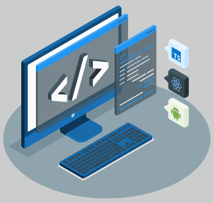

<!-- #  Hello world!&nbsp; -->

<!--
 style="width: 100%" /> -->
<h2>I’m Sarai, a Juniour Frontend Developer located in the GTA </h2>

<ul>
<li>🌱 I’m currently learning more about React through The Modern React Bootcamp (Hooks, Context, NextJS, Router) course on Udemy</li>
<li>🤔 I’m looking for help expanding my knowledge</li>
<li>💬 Ask me about anything</li>
</ul>

<h2>A Tech Enthusiast who likes:</h2>
<ul>
<li>💭 Solving Solutions </li>
<li>👾 Coding</li>
<li>📚 Reading</li>
<li>🥾 Hiking</li>
<li>🧗🏽‍ Rock Climbing</li>
</ul>

<h2>Pronouns</h2>
She/Her 👩🏽‍💻

<h2>📫 Let's Connect</h2>

[LinkedIn](https://www.linkedin.com/in/sarai-flores/)

[My personal portfolio](https://saraiflores.ca)

<!---
saraiflo/saraiflo is a ✨ special ✨ repository because its `README.md` (this file) appears on your GitHub profile.
You can click the Preview link to take a look at your changes.
--->
